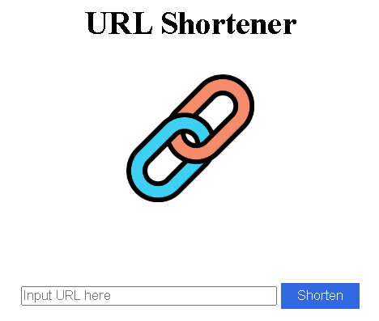
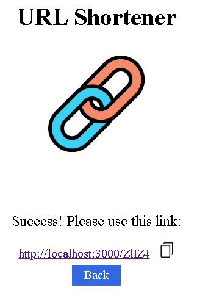

# URL Shortener





A web app that you can transform your long URL to be shorter!

## Getting Started

> Ensure `Node.js` is installed on your machine

1. Clone the repo

   ```bash
   $ git clone https://github.com/Jerry-Chang975/My-URL-Shortener.git
   ```

2. Go to the project directory

   ```bash
   $ cd My-URL-Shortener
   ```

3. Install the required npm packages

   ```bash
   $ npm install
   ```

4. Start the web app

   ```bash
   $ npm run start
   ```
